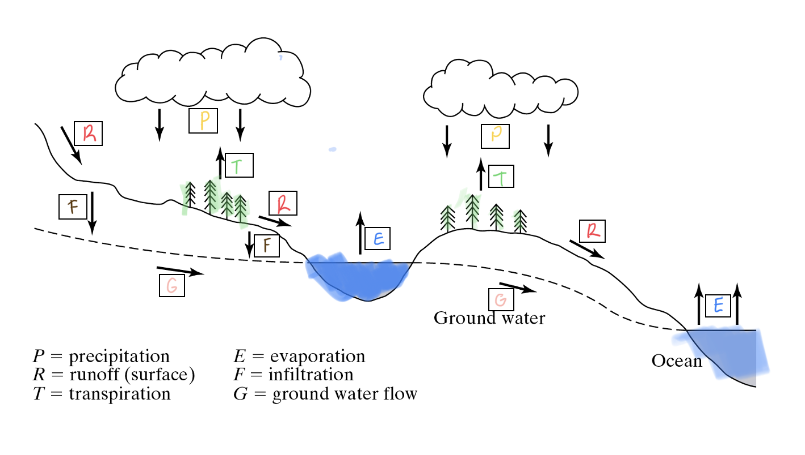

```{r setup and libraries, include=FALSE, echo=FALSE}
knitr::opts_chunk$set(echo = TRUE)
library(janitor)
```

## 1. A standard Class A Evaporation Pan (diameter 47.5 inches) begins the month of June with 10 inches of water in it.  At the end of June, the pan only has 5 inches in it.  Note that it also rained 2 inches in June.  Knowing the density of water is 1000 kg/m3, what would you say is the closest estimate for the **mass** of water lost from the pan in the month of June? **5 points**

```{r}
diam_1 <- 41.5 #inches
JuneA_1 <- 10 #inches, begging of month
JuneZ_1 <- 5 #inches, end of month
JunePrecip_1 <- 2 #inches, june precipitation 
Wden_1 <- 1000 #kg/m3, water density 

#Find the EV in inches
EV_1 <- JuneA_1 - JuneZ_1 + JunePrecip_1

#Find Water Volume at the end of June
Vol_in3_1 <- 3.14 * (diam_1/2)^2 * EV_1 #in3, Volume of cylinder = Pi * r2 * h

#Transform cubic inches to cubic meters
Vol_m3_1 <- Vol_in3_1/61020 

#How much in Kg?
Mass_kg_1 <- Vol_m3_1*1000 #Density = mass/volume

```

```{r, echo=FALSE}

print(paste("The water mass lost in June is",round(Mass_kg_1,2),"kg"), quote = FALSE)

```

## 2. A watershed has an area of 25 miles2. A rain event of 0.25 inch falls on that watershed. One-third of that rain infiltrates into the ground, and the rest becomes runoff. **15 points**

a. What is the total **volume** of rain over the watershed? (Report your answer in acre-ft.)

b. What is the total **volume** of runoff from the watershed? (Report your answer in acre-ft.)


```{r Problem 2}

Area_2 <- 25 #miles2
Prepipitation_2 <- 0.25 #inch 
Infiltration_2 <- Prepipitation_2*(1/3) #inch
RunOff_2 <- Prepipitation_2 - Infiltration_2 #inch

#B = Total volume of Rain Over Watershed, transform inches to miles
Precipitation_miles3_2 <- (Prepipitation_2/63360) * Area_2

#Transform cubic miles to Acre-ft
Precipitation_acreft_2 <- Precipitation_miles3_2*3.379e+6

# A = Total volume runoff from the watershed, transform inches to miles
RunOff_miles3_2 <- (RunOff_2/63360) * Area_2

#Transform runoff to Acre-ft 
RunOff_acreft_2 <- RunOff_miles3_2*3.379e+6

```

```{r, echo=FALSE}

print(paste("a = The volume of rain over the watershed is",round(Precipitation_acreft_2,1),"acre-f"), quote = FALSE)

print(paste("b = The volume of runoff over the watershed is",round(RunOff_acreft_2,1),"acre-f"), quote = FALSE)
```

c. If some of the native vegetation in the watershed is removed and replaced with a new housing development, would you expect the runoff to increase or decrease? Explain your answer using specific examples

*If we model that there is no difference in the precipitation after the land use change, evapotranspiration is unknown, and there is no management strategies that would keep infiltration at a similar rate, the run off will increase. When deep rotted vegetation is replaced by shallow turf and miles of concrete and roofs, rain will inevitably pour thru the streets at higher rates.*

\newpage 

## 3. In the space below, describe the hydrologic cycle and all its components in 3-4 sentences.  Then, in the following image, label the arrows showing the hydrologic fluxes using the letter in the key provided. **20 points**

<center>
{width=70%}
</center> 

*Evaporation: Water in the earth surface is bombarded by solar radiation, resulting in temperature increases. With enough latent heat, water change states and becomes vapor and moves in to the atmosphere. How many molecules enter the atmosphere depends on the vapor pressure, witch increases non-linearly with temperature.*

*Transpiration: Inside plants, capillary forces in the xylem breaks the force of gravity and transports water from the lithosphere to the atmosphere. Transpiration rates depends on the weather and plant biology. Radiation, Temperature, Wind and Humidity influences how much water gets to be pumped by the atmosphere. As a form of resistance, plants have evolved different water use adaptions that can subdue the force of physics, like stomachs aperture regulation and changes in time of respiration cycles.*

*Precipitation: The Temperature influence the amount of room that water vapor has in the atmosphere. There is more room when the air is warm, and less room when the air is cold, when the atmosphere reaches high levels of humidity, it falls to the earth. Before falling, molecules interacts with each other, the temperature and  other particles to form different types of precipitation; rain, snow, hail and drizzle among others.*

*Surface Runoff: When water hits the ground, some of it gets inside the soil layers, the excess moves thru the surface following gravitational forces. Soil Saturation, surface permeability and topography greatly affects runoff. Runoff can shape the topography by carrying sediments in the way of filling rivers, lakes and oceans*

*Infiltration: Before the soil saturates, some water gets to flow inside the soil layers. Infiltration depends on soil texture, water content and land use. The bigger the pores between soil particles, the more water moves in less time. Permeability depends on land use, deep roded vegetation allows for more infiltration than no vegetation or many human structures.*

*Ground Water flow: Infiltrated water generates streamflow inside the soil that follows the topography of the land. Inside the soil are many obstacles that makes the flow slower than surface flow, and depends of gradients of pressure inside the soil. Water pressure and the spaces between soil particles and rocks influences the flow, the flow stops once the mechanical energy is lost, adding volume to aquifers and surface water bodies*

\newpage


## 4. In one of the first lectures from class, we discussed the 21 major watersheds within the United States. Furthermore, we discussed the standardized method in which ‘Hydrologic Units Codes’ are used to represent the scale of these different watersheds. What is the **6-digit Hydrologic Unit Code** for the Santa Cruz River Basin near Tucson? Please provide the website link in which you found this information. **5 points**

\newpage

## 5. A soil retention curve examines the relationship between soil water content and soil water potential. Explain why the curve is different for when soils become more wet (wetting) compared to when they dry (drying). **10 points**
<center>
{width=50%}
</center>

\newpage

## 6.  In class, we have often used publicly available data from the US Geological Society (USGS) in our labs and problem sets. You have learned how to navigate the USGS website and to access data. For this assignment, please use the USGS website to answer the following questions (you must find the website yourself). **25 points**

a) For the San Pedro River near Tombstone, AZ (USGS gage 09471550), download the peak stream discharge data for the time period available (1967-2015). Using this dataset, construct a Probability of Exceedance Plot in Excel and **insert the figure in your answer**. You may recall that the plot has the “Annual Exceedance Probability (expressed as %) on the x-axis and “Annual Peak Discharge” (expressed as CFS) on the y-axis. Also, remember to express both your x- and y-axis in log scale so that your relationship is relatively linear. Please label your axis clearly. **(15 pts)**

b) What is the return period of a 10,000 cfs flood? **(5pts)**

c) Estimate the magnitude (expressed as cfs) of a 50 year flood. **(5pts)**

\newpage

## 7. You have been working with a contractor that needs to help a developer planning to build a residential neighborhood in Sahuarita that is concerned about overland flow.  Your job is to get a handle on the infiltration capacity of the soil.  Your field work has resulted in the table below.  You also have estimated an average initial rate of infiltration at 0.7 cm hr-1 with an average final capacity of 0.5 cm hr-1.  Use Horton’s equation (with an empirical constant of 0.1 hr-1) to estimate the infiltration capacity at t = 30 min, 1 hr, 1.5 hr, 2 hr, and 2.5 hr, 3 hr, and 3.5 hr as in the table below. With this information, determine the excess of rainfall (runoff) in cm hr-1. What is the average ratio of runoff to rainfall for the storm that you used in your fieldwork?  Should the developer be concerned?  Explain why or why not. **20 points**

```{r Table Question 7, echo=FALSE}

df_7 <- data.frame(matrix(ncol = 4, nrow = 7))
x7 <- c("Time (hr)", "Rainfall Intensity (cm hr-1)", "Infiltration (cm hr-1)", "Runoff (cm hr-1)")
colnames(df_7) <- x7


df_7$`Time (hr)`<- c("0 - 0.5", "0.5 – 1", "1 – 1.5", "1.5 – 2", "2 – 2.5", "2.5 – 3", "3 – 3.5")

df_7$`Rainfall Intensity (cm hr-1)`<- c(1.0, 0.7, 2.0, 2.5, 2.8, 1.5, 0.5)

#df_7$`Infiltration (cm hr-1)` <- c()

#df_7$`Runoff (cm hr-1)` <- c()

knitr::kable(adorn_totals(df_7, where = "row", fill = "-"))
```

\newpage

## 8. Two tensiometers are installed into unsaturated soil to determine the direction of unsaturated water flow. Tensiometer A measures pressure head PhiA at a depth of 20 cm, and tensiometer B measures pressure head PhiB at a depth of 60 cm.  The following results are obtained for three different treatments (1 through 3). **20 points**

```{r Table Question 8, echo=FALSE}

df_8 <- data.frame(matrix(ncol = 4, nrow = 3))
x8 <- c("Treatment", "PhiA(cm)", "PhiB(cm)", "Flow Direction")
colnames(df_8) <- x8


df_8$`Treatment`<- c(1,2,3)

df_8$`PhiA(cm)`<- c(-123,-211,-9)

#df_8$`Flow Direction` <- c()


knitr::kable(adorn_totals(df_8, where = "row", fill = "-"))

```
Briefly describe a tensiometer. Draw these scenarios in the space below, **including your reference point**. Determine the flow direction under each treatment (A to B or B to A). 


\
\

**I promise that I have not asked nor received help from anyone on this final. _______________**
