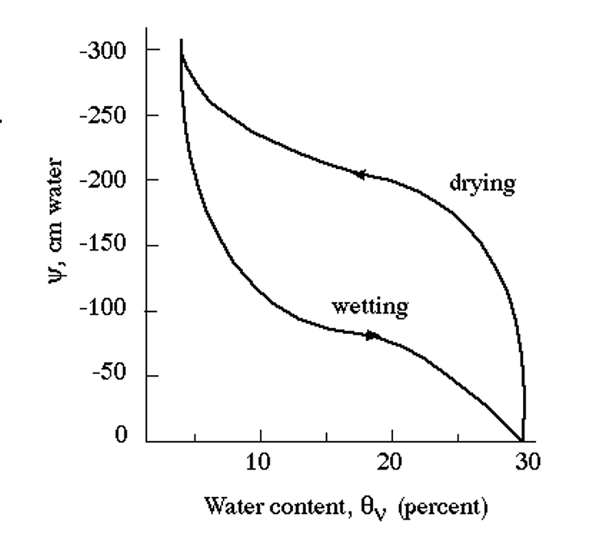
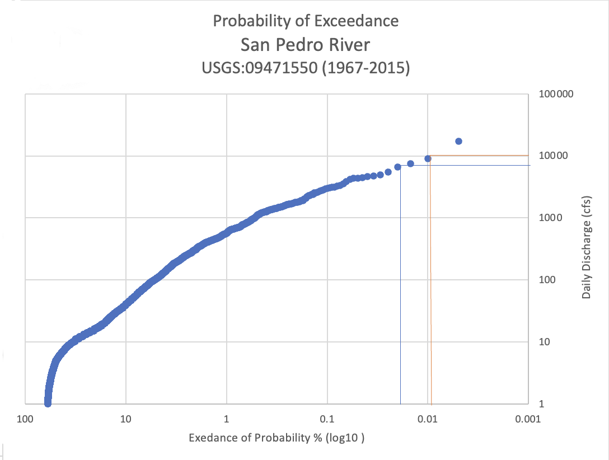

```{r setup and libraries, include=FALSE, echo=FALSE}
knitr::opts_chunk$set(echo = TRUE)
library(janitor)
library(kableExtra)
```

## 1. A standard Class A Evaporation Pan (diameter 47.5 inches) begins the month of June with 10 inches of water in it.  At the end of June, the pan only has 5 inches in it.  Note that it also rained 2 inches in June.  Knowing the density of water is 1000 kg/m3, what would you say is the closest estimate for the **mass** of water lost from the pan in the month of June? **5 points**

```{r}
diam_1 <- 41.5 #inches
JuneA_1 <- 10 #inches, begging of month
JuneZ_1 <- 5 #inches, end of month
JunePrecip_1 <- 2 #inches, june precipitation 
Wden_1 <- 1000 #kg/m3, water density 

#Find the EV in inches
EV_1 <- JuneA_1 - JuneZ_1 + JunePrecip_1

#Find Water Volume at the end of June
Vol_in3_1 <- 3.14 * (diam_1/2)^2 * EV_1 #in3, Volume of cylinder = Pi * r2 * h

#Transform cubic inches to cubic meters
Vol_m3_1 <- Vol_in3_1/61020 

#How much in Kg?
Mass_kg_1 <- Vol_m3_1*1000 #Density = mass/volume

```

```{r, echo=FALSE}

print(paste("The water mass lost in June is",round(Mass_kg_1,2),"kg"), quote = FALSE)

```

\newpage

## 2. A watershed has an area of 25 miles2. A rain event of 0.25 inch falls on that watershed. One-third of that rain infiltrates into the ground, and the rest becomes runoff. **15 points**

a. What is the total **volume** of rain over the watershed? (Report your answer in acre-ft.)

b. What is the total **volume** of runoff from the watershed? (Report your answer in acre-ft.)


```{r Problem 2}

Area_2 <- 25 #miles2
Prepipitation_2 <- 0.25 #inch 
Infiltration_2 <- Prepipitation_2*(1/3) #inch
RunOff_2 <- Prepipitation_2 - Infiltration_2 #inch

#B = Total volume of Rain Over Watershed, transform inches to miles
Precipitation_miles3_2 <- (Prepipitation_2/63360) * Area_2

#Transform cubic miles to Acre-ft
Precipitation_acreft_2 <- Precipitation_miles3_2*3.379e+6

# A = Total volume runoff from the watershed, transform inches to miles
RunOff_miles3_2 <- (RunOff_2/63360) * Area_2

#Transform runoff to Acre-ft 
RunOff_acreft_2 <- RunOff_miles3_2*3.379e+6

```

```{r, echo=FALSE}

print(paste("a = The volume of rain over the watershed is",round(Precipitation_acreft_2,1),"acre-f"), quote = FALSE)

print(paste("b = The volume of runoff over the watershed is",round(RunOff_acreft_2,1),"acre-f"), quote = FALSE)
```

c. If some of the native vegetation in the watershed is removed and replaced with a new housing development, would you expect the runoff to increase or decrease? Explain your answer using specific examples

*If we model that there is no difference in the precipitation after the land use change, evapotranspiration is unknown, and there is no management strategies that would keep infiltration at a similar rate, the run off will increase. When deep rotted vegetation is replaced by shallow turf and miles of concrete and roofs, rain will inevitably pour thru the streets at higher rates.*

\newpage 

## 3. In the space below, describe the hydrologic cycle and all its components in 3-4 sentences.  Then, in the following image, label the arrows showing the hydrologic fluxes using the letter in the key provided. **20 points**

*When solar radiation hits liquid water bodies, heat builds up and at evaporation point water moves to the atmosphere, plants also add water to the atmosphere through transpiration. Temperature influence the amount of room that water vapor has in the atmosphere, when there is too much water, water molecules and air particles coalesce and water precipitates to the earth in referent forms.  When water hits the ground, depending soil characteristics and land use, part of its infiltrated inside the soil and the excess moves along the earth surface creating runoff. Infiltrated water moves between soil pores and rocks creating ground water flow, both surface and ground water flow follows gravitational forces, the flow stops once the mechanical energy is lost, adding volume to water bodies*

<center>
{width=70%}
</center> 


\newpage


## 4. In one of the first lectures from class, we discussed the 21 major watersheds within the United States. Furthermore, we discussed the standardized method in which ‘Hydrologic Units Codes’ are used to represent the scale of these different watersheds. What is the **6-digit Hydrologic Unit Code** for the Santa Cruz River Basin near Tucson? Please provide the website link in which you found this information. **5 points**

*The hidrologic unit code is 150503, I used the water resources page from USGS https://water.usgs.gov/lookup/getwatershed?15050301*


## 5. A soil retention curve examines the relationship between soil water content and soil water potential. Explain why the curve is different for when soils become more wet (wetting) compared to when they dry (drying). **10 points**

<center>
{width=50%}
</center>

*This curve shows the relationship between water content and water potential, witch shows the tendencies in the movement of water. When soils start to smaller pores fill because capillary suction is high, that's why water content takes time to increase. When soils starts to dry, water content remains unchanged because of the capillary actions, only after the water potential gets low enough, water content starts to decrease, small pores are the last one to dry.*

\newpage

## 6.  In class, we have often used publicly available data from the US Geological Society (USGS) in our labs and problem sets. You have learned how to navigate the USGS website and to access data. For this assignment, please use the USGS website to answer the following questions (you must find the website yourself). **25 points**

a) For the San Pedro River near Tombstone, AZ (USGS gage 09471550), download the peak stream discharge data for the time period available (1967-2015). Using this dataset, construct a Probability of Exceed Plot in Excel and **insert the figure in your answer**. You may recall that the plot has the “Annual Exceedance Probability (expressed as %) on the x-axis and “Annual Peak Discharge” (expressed as CFS) on the y-axis. Also, remember to express both your x- and y-axis in log scale so that your relationship is relatively linear. Please label your axis clearly. **(15 pts)**

{width=50%}

b) What is the return period of a 10,000 cfs flood? **(5pts)**

*At At 10,000 cfs, the return period is between 0.009% and 0.004%*

c) Estimate the magnitude (expressed as cfs) of a 50 year flood. **(5pts)**

*1/P= return interval* \newline
*Pe = 1/50* \newline
*Pe = 0,02, ~ 6580 cfs*

\newpage

## 7. You have been working with a contractor that needs to help a developer planning to build a residential neighborhood in Sahuarita that is concerned about overland flow.  Your job is to get a handle on the infiltration capacity of the soil.  Your field work has resulted in the table below.  You also have estimated an average initial rate of infiltration at 0.7 cm hr-1 with an average final capacity of 0.5 cm hr-1.  Use Horton’s equation (with an empirical constant of 0.1 hr-1) to estimate the infiltration capacity at t = 30 min, 1 hr, 1.5 hr, 2 hr, and 2.5 hr, 3 hr, and 3.5 hr as in the table below. With this information, determine the excess of rainfall (runoff) in cm hr-1. What is the average ratio of runoff to rainfall for the storm that you used in your fieldwork?  Should the developer be concerned?  Explain why or why not. **20 points**

$$f(t) = fc + (fo - fc)e^{-kt}$$


```{r}
#Creates the variables
fo_7 <- 0.7 #cm hr-1
fc_7 <- 0.5 #cm hr-1
kt_7 <- 0.1 #hr-1

#Creates the time and rainfall lists
t_7 <- c((30/60), 1, 1.5, 2, 2.5, 3, 3.5)
r_7 <- c(1.0, 0.7, 2.0, 2.5, 2.8, 1.5, 0.5)

#creates horton equation function
Horton_eq_7 <- function(fo, fc, k, t) {
  ft <- fc + (fo - fc)*exp(-k*t)
  return(ft)}

#Creates empty list
ft_2 <- list()

#loops the time
for(i in 1:7){
  ft_2[[i]] <- round(Horton_eq_7(fo_7, fc_7, kt_7,t_7[i]),2)}

#Creates a list of runoff v. precip
Roff_7 <- unlist(mapply('-', t_7, r_7, SIMPLIFY = FALSE))

#Runoff/Rainfall Ratio and find mean
R_R_7 <- unlist(mapply('/', Roff_7, r_7, SIMPLIFY = FALSE))
R_R_avg_7 <- mean(R_R_7)
```

```{r Table Question 7, echo=FALSE}

df_7 <- data.frame(matrix(ncol = 4, nrow = 7))
x7 <- c("Time (hr)", "Rainfall Intensity (cm hr-1)", "Infiltration (cm hr-1)", "Runoff (cm hr-1)")
colnames(df_7) <- x7

df_7$`Time (hr)`<- c("0 - 0.5", "0.5 – 1", "1 – 1.5", "1.5 – 2", "2 – 2.5", "2.5 – 3", "3 – 3.5")

df_7$`Rainfall Intensity (cm hr-1)`<- c(1.0, 0.7, 2.0, 2.5, 2.8, 1.5, 0.5)

df_7$`Infiltration (cm hr-1)` <- ft_2

df_7$`Runoff (cm hr-1)` <- Roff_7

#Alling content in center, center the table, preseve chunk order
kbl(df_7, booktabs = T, align="c")  %>% kable_styling(position = "center", latex_options = c("striped", "hold_position"))
```

```{r, echo=FALSE}

print(paste("The ratio of runoff/rainfall is ",round(R_R_avg_7,2)), quote = FALSE)

```

*For every mm of rain, 91%  becomes runoff. The developer should be concern, because there is not enough infiltration to prevent floods in the neighborhoods*
\
\

#### 8. Two tensiometers are installed into unsaturated soil to determine the direction of unsaturated water flow. Tensiometer A measures pressure head PhiA at a depth of 20 cm, and tensiometer B measures pressure head PhiB at a depth of 60 cm.  The following results are obtained for three different treatments (1 through 3). **20 points** 
\

```{r}
#Data, Pressure head at point
PhiA <- c(-123,-211,-9) 
PhiB <- c(-22,-185,-65)

#Depths heads
Eh1 <- -20 #Elevation head at point 1 in cm
Eh2 <- -60 #Elevation head at point 2 in cm

#Question
#Calculate the hydraulic head at each point
HhA <- list()
HhB <- list()

#loops all the pressure head data, sums every pressure head with the respective depths
for(i in 1:3){
  HhA[[i]] <- PhiA[i] + Eh1
  HhB[[i]] <- PhiB[i] + Eh2
  }

```

</center> 


```{r Table 2 Question 8, echo=FALSE}

df_8 <- data.frame(matrix(ncol = 6, nrow = 3))
x8 <- c("Treatment", "PhiA(cm)", "PhiB(cm)","HhA(cm)", "HhB(cm)","Flow Direction")
colnames(df_8) <- x8


df_8$`Treatment`<- c(1,2,3)

df_8$`PhiA(cm)`<- PhiA

df_8$`PhiB(cm)`<- PhiB

df_8$`HhA(cm)`<- unlist(HhA)

df_8$`HhB(cm)`<- unlist(HhB)

df_8$`Flow Direction` <- c("A","B","B")

kbl(df_8, booktabs = T, align="c")  %>% kable_styling(position = "center", latex_options = c("striped", "hold_position"))
```
</center> 

\newpage

Briefly describe a tensiometer. Draw these scenarios in the space below, **including your reference point**. Determine the flow direction under each treatment (A to B or B to A). 

*A tensiometer is a tube with a porous end and a vacuum gauge at the top, the tube is filled with water and introduce in the ground. A pump adds pressure to the water inside the tube and because of the porous end it makes contact with the soil water, once both sides are in equilibrium the matric potential can be read *

{width=30%}


{width=30%}

{width=30%}


\
\

**I promise that I have not asked nor received help from anyone on this final. _______________**
