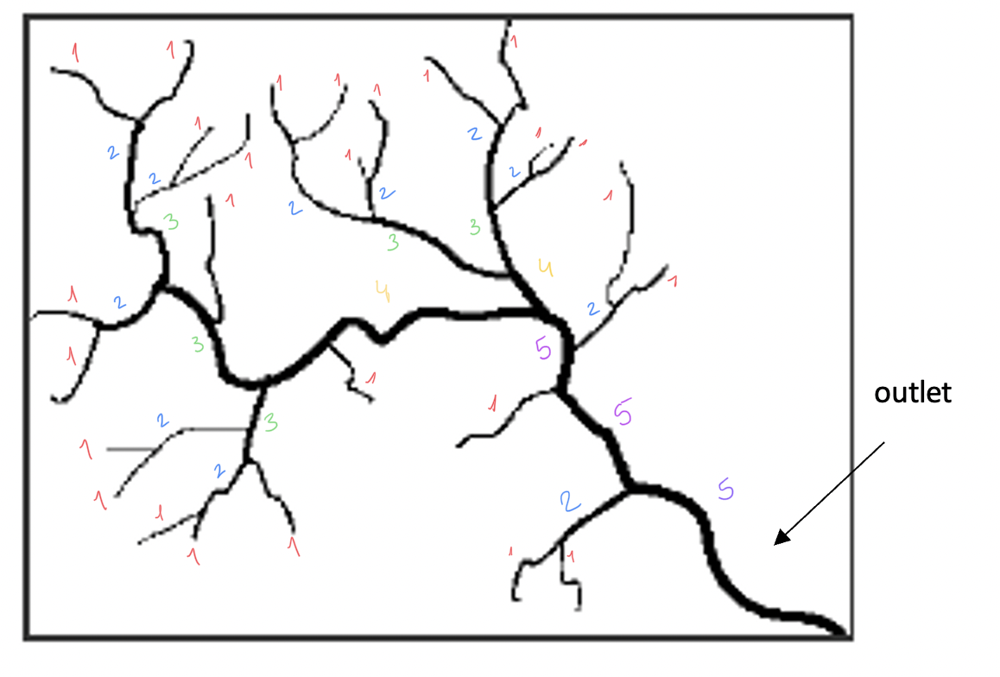
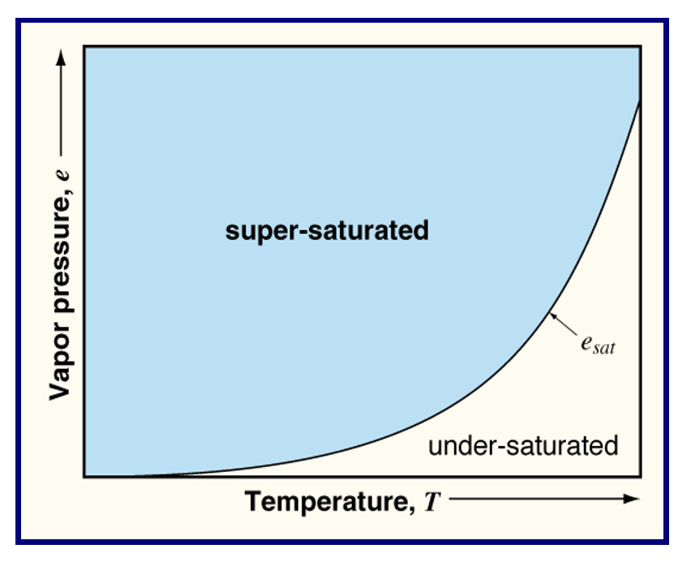
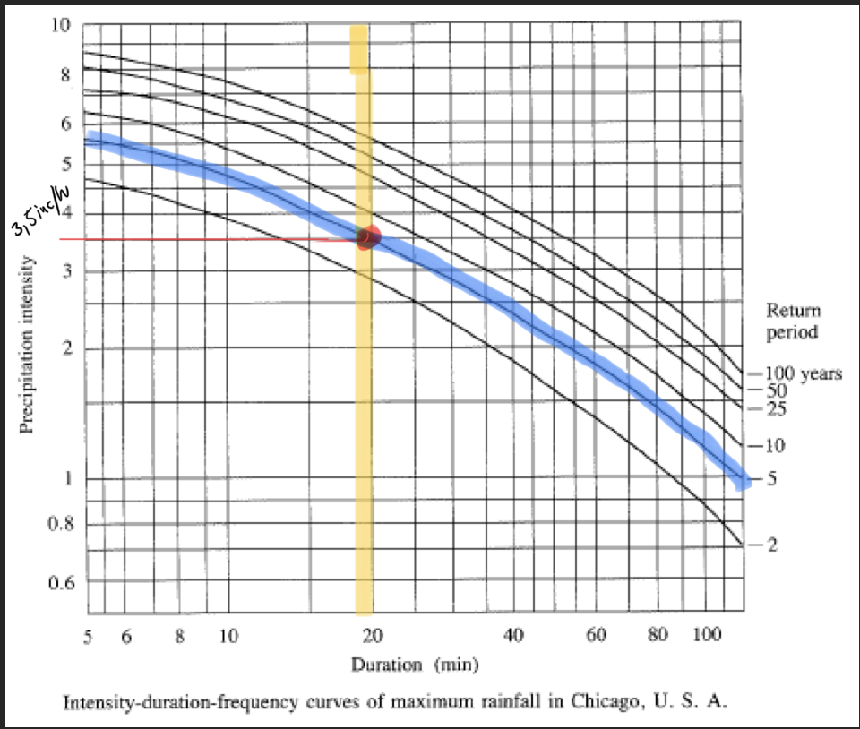
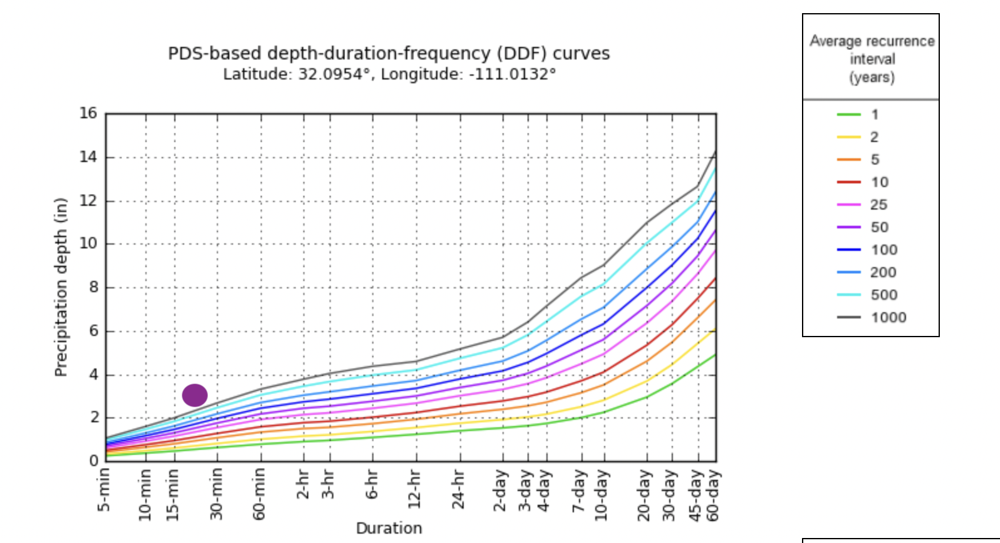
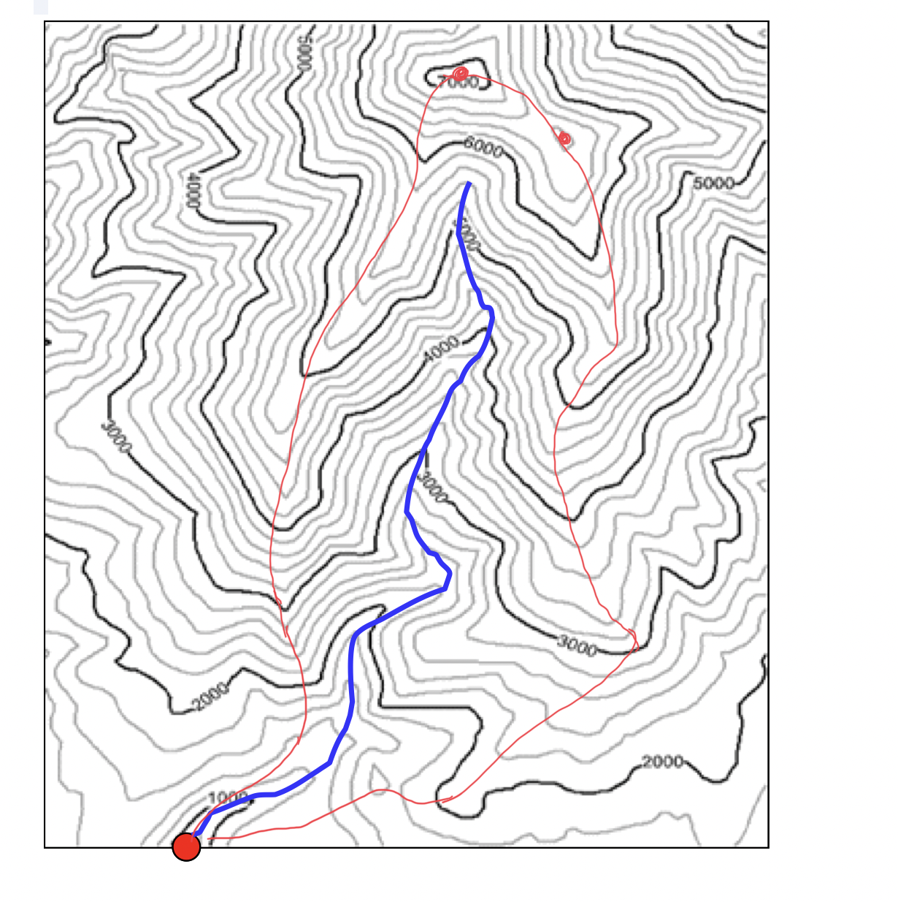

```{r include=FALSE}
knitr::opts_chunk$set(echo = TRUE)
library(janitor)
```

Please show all work associated with calculations and circle your answers. If I cannot read your handwriting, I cannot grade your exam, so please write as legibly as possible. The total number of points on this exam is 120.


## 1. For Question 1, answer the following questions **(35 points total)**:

a. A runoff event yielded 20,000 cubic meters of water from a 150 sq. kilometer watershed.  Convert the runoff to mm. **(5 points)**

 b. If you measured 15 mm of rainfall for a storm with a 45 minute duration what is the rainfall intensity in mm/hr? **(5 points)**

```{r}
Runoffm3 <- 20000 #m3
Area <- 150 #m2

Runoffmm <- Runoffm3/Area * 1000

```

```{r, echo=FALSE}
Runoffmm <- round(Runoffmm,2)

print(paste("a = The runoff is",format(Runoffmm, big.mark=",", nsmall = 2),"mm"), quote =FALSE)
```


```{r}
#Rainfall Intensity 
rainfall <- 15 #mm
duration <- 45 #minute
duration_h <- 45/60 #Convert minute to hour, 

#If 15 mm fell in 0.75 how much mm would fell in 1 hour?
rainfall_h <-  rainfall / duration_h 

```

```{r, echo=FALSE}

print(paste("b = The rainfall instensity is",rainfall_h,"mm/hr"), quote=FALSE)

```


c. What is albedo?  Why is albedo important for estimating Net Radiation at the earth surface? **(5 points)**

*Albedo is the ratio of absortion versus reflectance in a surface, the higher the albedo the more the surface reflects. Albedo will let you know how much shortwave radiation is absorbed and how much long wave radiation is being re-release to the atmosphere*

d. Describe and contrast the two types of methods for estimating watershed precipitation: 1) arithmetic average, 2) hypsometric method. **(5 points)**

*The hypsometric method uses the relationship of elevation and rainfall to estimate the value of rain, while the arithmetic average uses the mean between the gauges without weighting any other value. Rain in a watershed would most likely change according elevation, we can have better interpolations if we add the altitude of the gauges as a variable.*

e. What are the three physical factors that drive the ET process? **(5 points)**

*For evaporation to happen, we need water and heat. For transpiration to happen when the a plant release water to the atmospheres thur their photosynthetic organs. To keep both process going we need Wind, Radiation and a change in relative humidity.*

*Radiation as latent heat makes liquid water turn to gas, this gas enters into  the atmosphere to find either more water molecules or less water molecules. The amount of water in the air measured in percentage is relative humidity. If the air is saturated with water, it means that ET would be limited. Wind renews the air around the source, with air that can be filled with more water, increasing ET.*

*Wind must renew the air around the source so more water can leave. 
more radiation means more water transforming to vapor and more photosynthesis and more water consumption. The humidity in the air also plays a big factor in ET, if we have wind but is just saturated with water and the sun is high, we would reach a limit on the quantity of water this sources can give to the atmosphere*

f. What is a watershed?  Identify three watershed characteristics. **(5 points)**

*A watershed is an ecology study area, where all the surface water that flows there ends in the same point, that point would eventually end in a stream or the ocean.*

*We can characterize a watershed by looking at topography, understanding their  climate, and analyzing their land use. Topography studies the elevation, how big is the slope, what is the shape of the catchment and where it ends up draining. Climate offer us a way to understand how much radiation would catchment receives and when, and how much precipitation can we it get. Finally  land use will give us clues about what kind of vegetation is on the ground and if we can foresee any land compaction or other human intervention like dams*

g. What is the Strahler stream order at the outlet? **(10 points)**

**Its 5!**
<center>
{width=50%}
</center>
\newpage 

## 2. In the north central United States the forest industry is converting thousands for acres from red pine and spruce (both conifers) to aspen (a hardwood).  Discuss the potential impact you could expect from this conversion on the hydrologic cycle, including changes in interception, evapotranspiration, and annual streamflow. **(10 points)**

*Conifers are evergreen tress that have the same amount of foliage all year around. In a conifer forest ET might be bigger overall, being only limited by abiotic factors such as wind and radiation. The albedo would be low most time of the year, and in the winter this would make the snow pack melt sooner, the forest will absorb more energy also augmenting ET. Interception will not change much between season.*

*Aspen tress are deciduous, the winter will find no interception of the canopy and the soil will have a greater snow pack than in the conifers. The high albedo of the watershed would reflect most of the radiation and the packs of ice will last longer.The ET would only start to increase as slow as leaves grow*

*The annual stream flow in a Conifers forest would be less erratic, while the Aspens will allow more snow accumulation and the stream flow  will be bigger at the beginning of the spring, once the snow pack is gone the stream flow would be the similar as a Conifer forest*

## 3. On average, Tucson received roughly 500 mm of precipitation each year. **(15 points total)**

a) Using the water budget equation, along with your understanding of the hydrologic cycle in this area, describe and quantify to the best of knowledge, the fate of this precipitation input. For example, what percentage of total precipitation is lost through evapotranspiration, discharge (or streamflow), or storage? **(5 points)**

*Considering the amount of radiation Tucson gets most of the inputs would go to evaporation. Nonetheless, urban development can augment runoff by adding concrete and asphalt to the soil reducing  storage, ET and interception. In my head around 70% would go ET, 5% storage and 25% to runoff*

b) Describe unique components, situations, or assumptions that might apply to Tucson in particular. Be thorough with your answer. **(5 points)**

*Tucson is home to many watersheds and they propose their own management challenges. More urban catchments will experience greater runoff, that had to be channeled correctly to avoid flash floods. Catchments with more vegetation would experience higher ET, less runoff and more water conservation. Besides the types of watershed, there are also two weather scenarios in Tucson, Big Monsoons and Drought.*

*Deserts like Tucson would grow incredibly fast once they have rain, producing biomass with all that extra radiation. This means that at the end of the monsoon season (beginning of fall) the ET would be at its highest, after that temperature and radiation would start to diminish and greenness would slowly decay. Winter rains are not as big as monsoon season rains but they add pulses of green before the spring begins, runoff might be bigger during the first few rains, and  when the vegetation will catch up, it will increasing ET. Greener areas would eventually absorb most the shortwave radiation from the sun and cool down the area, lower temperatures would facilitate the formation of more rain. The cycle would stop after the summer comes in and jacks up the temperature, creating droughts if the conditions are suitable.* 

*Droughts are very regular in Tucson, while all the vegetation  dies or sleeps, transpiration would probably take over the outputs in the watersheds. Barren land would increase, and as a consequence the albedo would increase too, increasing the longwave radiation and with it, the temperature. Higher temperatures and radiation would make harder for the atmosphere around Tucson to be saturated with water, witch means less rains. The end of summer means lower temperature, and when the first winter rains comes around, runoff would be higher because of the lack of vegetation to catch the water. Once the pulses of water makes a greener Tucson again, ET would increase and the runoff would be limited once more*


c) How might development of nearby natural landscapes into housing neighborhoods change how total precipitation is lost through ET, discharge, or storage? **(5 points)**

*Vegetation intercepts water, perform ET and facilitates grown storage. A natural watershed of Tucson would receive an average amount of precipitation  and thru ET, runoff, and soil water movement the water would hit the streams.  Urban areas are notoriously bad at absorbing water, constructions and pavements increase discharge significantly and make its harder to store water. Increase runoff in a already water limited ecosystem is not the best scenario to encounter the effects of climate change.*

## 4. Using this figure, explain what **vapor pressure deficit (VPD)** and **dew point** are, and how the two are different from one another. You can either use words or equations in your explanation. **(10 points)**

*Vapor pressure deficit is the difference between the amount of moisture in the air and the amount of moisture the air can hold when saturated. When the air becomes saturated it will start to form fog, or dew, or just water in the surface of stuff. Temperature is the a big factor in water saturation, warm air can hold more water vapor than cold air (if we consider constant pressure). As the graph shows, changes in temperature can predict the saturation or not saturation of air. The temperature in witch the air becomes saturated is the dew point.*

*VPD and DP are different because the first is a measure of pressure (unit kPA) and the second is a measure of Temperature (units C,K,F). VPD tells your how much pressure change you need for the air to saturate, while DP tells you the temperature of that saturation point.*

<center>
{width=50%}
</center>
\newpage 

## 5. Using the IDF Curve below, determine the rainfall intensity (in/hr) and amount of rain (in) for a 20-min duration storm with 5-yr return period in Chicago.  Do you think the return period for a 20-min duration storm with the same intensity would have a higher or lower return period in Tucson?  Why? (10 points)

*In Chicago a rain as intense 3.5 in/hr  for 20 min, might happen every 5 years. In Tucson, for a rain as intense with during that amount of time will happen very rarely with a return time of more than >500, so its extremely unlikely.*

*For a storm you need energy and water. Tucson has, most of the time, more energy from radiation than Chicago does, but it has less water available to complete such an intense discharge of water in that low amount of time. Chicago on the other hand is right next to the great lakes, giving the area a greater water source that can be use once the energy arrives.*

{width=40%}

{width=60%}


\newpage

## 6. On an average year, a small watershed (3.0 km2) receives 950 mm of precipitation. The watershed is drained by a stream (with continuous data) and discharge is 1.1 x 106 m3. Assume groundwater recharge is negligible and storage is zero. **(15 points total)**

a. What is the depth of water lost through evapotranspiration (in mm)? (5 points)

b. What is the volume of water (in m3) lost through evapotranspiration for the year? (5 points)

c. What is the runoff ratio (rout/p)? (5 points)

```{r}
#DAta
Area_6_km2 <- 3 #Km2
Prep_6_mm <- 950 #mm
Q_6_m3 <-1.1e6 #m3


#1: Convert Area to m2
Area_6_m2 <- Area_6_km2 * 1e6 

#2: Convert Runoff from m3 to mm
Q_6_mm <- Q_6_m3/Area_6_m2 * 1000

#3:Apply the formula p = et + q  et = p - q
ET_6_mm <- Prep_6_mm - Q_6_mm 

```

```{r, echo=FALSE}

ET_6_mm <- round(ET_6_mm,2)

print(paste("a = The evapotranspiration is",ET_6_mm,"mm"), quote=FALSE)

```

```{r}
#Find the Volume of ET
#1: Transform ET from mm to m and apply ET*area_m2
ET_6_m3 = (ET_6_mm/1000)*Area_6_m2

```

```{r, echo=FALSE}
print(paste("b = The evapotranspiration is",format(ET_6_m3, big.mark=",", nsmall = 0),"m3"), quote = FALSE)
```

```{r}
#Find the runoff ratio
#1: Apply rout/p
Runoff_Ratio <- Q_6_mm / Prep_6_mm

```

```{r, echo=FALSE}

print(paste("c = The runoff ratio is",round(Runoff_Ratio,2)), quote = FALSE)

```

\newpage 

## 7. A lake with a surface area of 525 acres was monitored over a period of time.  During a one-month period the inflow was 31 ft3 s-1, the outflow was 28 ft3 s-1, and a 1.5 – inch seepage loss (from the bottom of the lake) was measured.  During the same month, the total precipitation was 4.25 in. Evaporation loss was estimated as 6.0 inches. **(10 points total)**
a. Estimate the storage change in this lake during the month (answer in inches). 
b. Did the lake gain or lose water during the month?  

```{r}
#1: Look at the data for one month
Area_7_acres <- 525 #acres
inflow_7_ft3s <- 31 #ft3 s-1
outflow_7_ft3s <- 28 #ft3 s-1
seepage_7_in <- 1.5 #inches per month
Precip_7_in <- 4.25 #inches per month
ET_7_in <- 6 #inches per month

#2: Convert units/dimensions
Area_7_ft2 <- Area_7_acres * 43560
#Volume to area
inflow_7_ins <- (inflow_7_ft3s/Area_7_ft2) * 12
outflow_7_ins <- (outflow_7_ft3s/Area_7_ft2) * 12

#in second to in month
inflow_7_inm <- inflow_7_ins * 2.628e6
outflow_7_inm <- outflow_7_ins * 2.628e6

#3: Water Balance
#p + rin = et + rout + s
IN_7_in <- Precip_7_in + inflow_7_inm
OUT_7_in <- ET_7_in + outflow_7_inm + seepage_7_in

CHANGE_7_in <- IN_7_in - OUT_7_in
```

```{r, echo=FALSE}

CHANGE_7_in <- round(CHANGE_7_in,2)

print(paste("a = The  storage change is",CHANGE_7_in,"in per month"), quote = FALSE)

print("b = The lake  gain water", quote = FALSE)
```

\newpage

## 8. On the following image, delineate the watershed associated with the gauge point indicated with the dot at the bottom of the image.  Briefly explain your method in the space below. **(10 points)**

<center>

{width=50%}

</center>

*I look for the high points first, I could only find two high points and I drew a line that intersects both hills. Then I look for the slops, there were two clear slopes  around the river.  I could identify them by seeing the U shape they form. With a line I cut all the U in half, delimiting most of the catchment. At the end I had to pay special attention to the flat part near the outpoint because the U where harder to identify.*


I promise that I have not asked nor received help from anyone on this final. _______________
								
