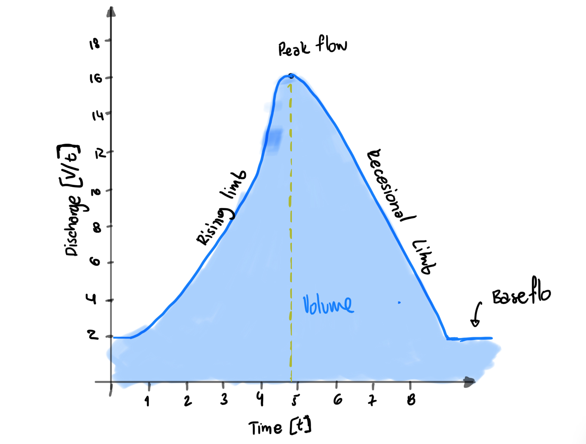
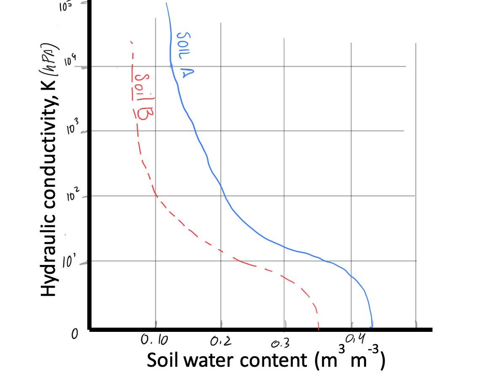
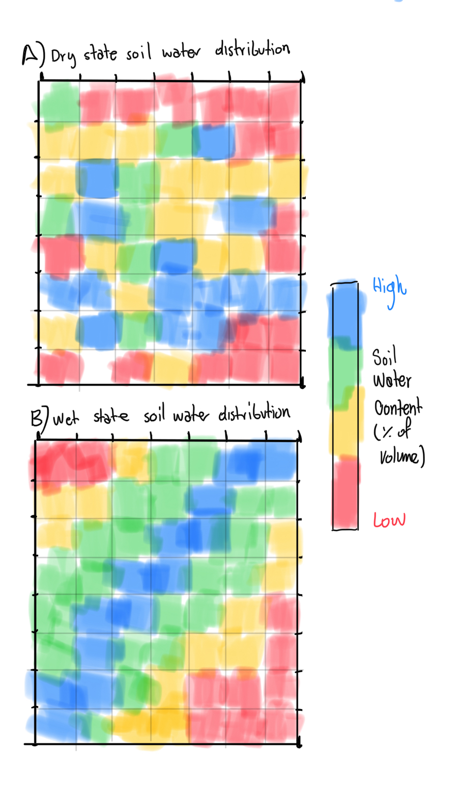
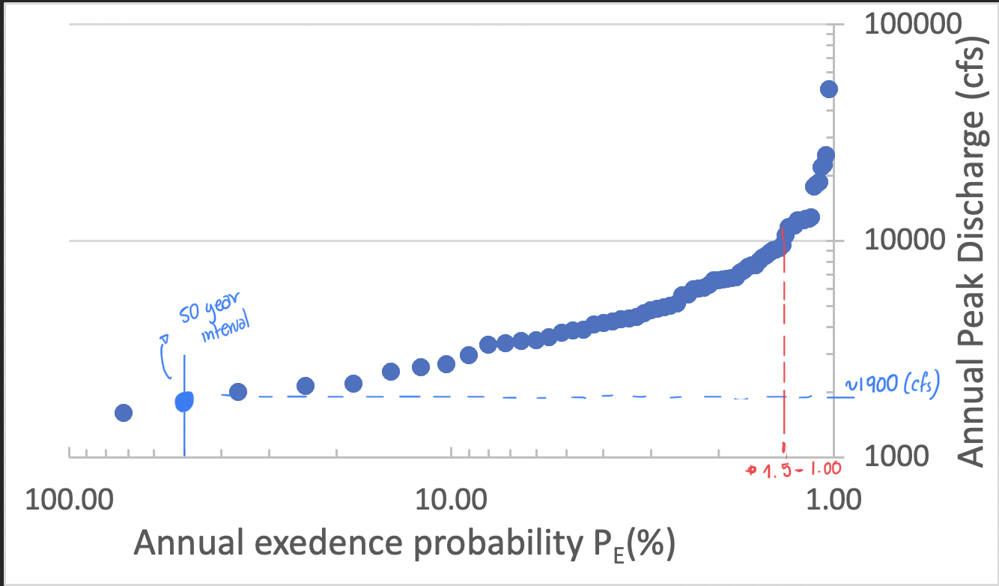
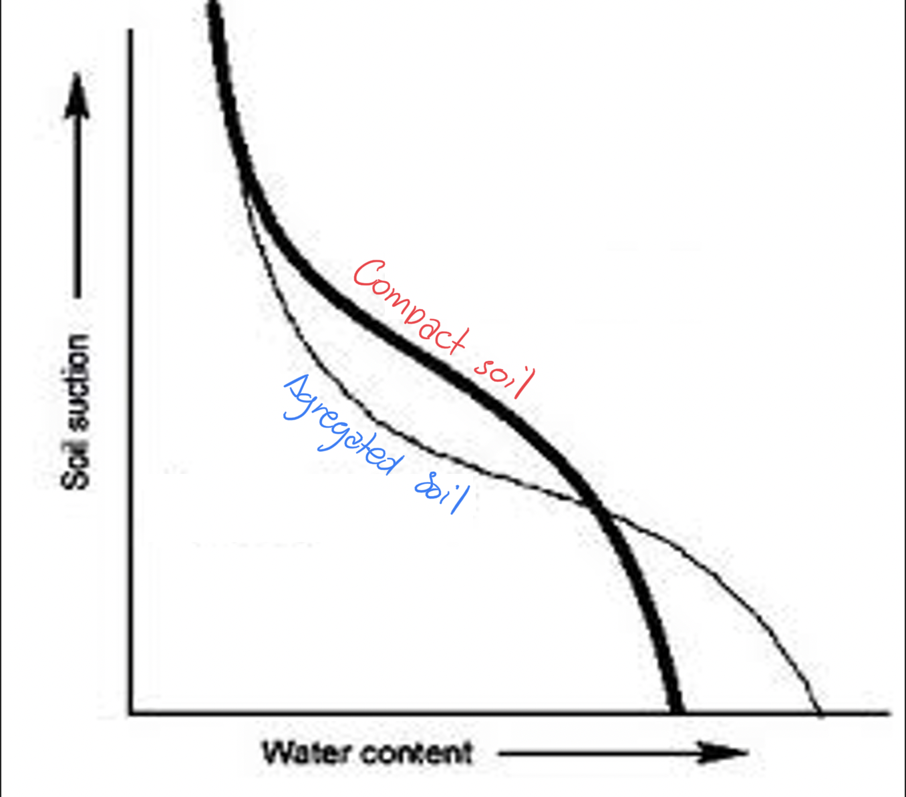

```{r setup, include=FALSE, echo=FALSE}
knitr::opts_chunk$set(echo = TRUE)
library(janitor)
```

### 1. Land use and land cover can have a significant impact of streamflow response. Discuss the relationship between peak flows and:
 a. Before and after removal of trees in a forested watershed. Explain why there are differences (i.e. what is the mechanism?). (5 pts)
  b. Increase in development in a watershed (e.g. increase in man-made structures). (5 pts)

*a) Trees are the straws of the landscape, they move water from the ground to the atmosphere thanks to hydraulic conductivity, moving the mass water from more to less. On average, infiltration is greater with dense vegetation. Supposing the a lost land cover went to agriculture, we can expect less evapotranspiration and infiltration than forest, so runoff would be greater, which will make peak flow greater*

*b) Man made structures would  compleatly removed the evapotranspiration from most plants, and impede infiltration of water. This will make the peak flow even greater than in the former example.*

### 2.  Precipitation events may or may not result in ponding of water and overland flow at the surface. Explain under what conditions ponding does occur (and can lead to flooding) and describe the two mechanisms by which it occurs. (10 pts)

*Pounding depends on the rate of rainfall and soil infiltration, this can happen because of this two scenarios:*

* *1) Rainfall Intensity > Infiltration: Runoff starts when the infiltration capacity has been overdrive,  water in excess moves out of the catchment area as stream flow or can later be stored or evaporated*

* *2) Hydraulic Conductivity < Rain Intensity <  Infiltration: Soils with high hydraulic conductivity have greater infiltration rates and less runoff (because of  soil pores size and distribution). Water flows not only because of gravity, but because of soil suction. When the water content increases soil suction increase, up to the point when water soil reach saturation*


### 3. Draw a hydrograph. Define the components: volume, peak flow, rising limb, and falling limb.   Define axis with units (10 pts).

{width=50%}

*Discharge is a measure of volume and time, like liters per hour. Time in Hours*

\newpage

### 4. For a particular soil of a given porosity: 
 a) Draw a solid line on the graph below indicating the relationship between soil hydraulic conductivity expressed as the log [K(theta)] and soil moisture (soil water content) for a soil type of your choice (5 pts).
 
 b) Now draw a dashed line on the same graph for another type of soils that is more sandy than the one you chose (5pts)  
Note: the y-axis should be drawn in log scale.

{width=80%}
\newpage

### 5. Given the information for the cross section, fill in the blanks (10 pts).

a. What is the total cross sectional area (m2)
b. What is the Discharge for the cross section (m3/sec)?
c. If the watershed is 0.1 square kilometers what is the discharge in mm/sec? 


```{r, echo=FALSE}

df_5 <- data.frame(matrix(ncol = 5, nrow = 5))
x <- c("Section Width (m)", "Depth of Section (m)", "Area of Section (m2)", "Velocity (m/sec)", "Discharge of Section (m3/sec)")
colnames(df_5) <- x

df_5$`Section Width (m)`<- c(0.3, 0.5, 0.5, 0.5, 0.3)

df_5$`Depth of Section (m)`<- c(0.2, 0.4, 0.6, 0.5, 0.2)

df_5$`Area of Section (m2)` <- c(0.06, 0.2, 0.3, 0.25, 0.06)

df_5$`Velocity (m/sec)` <- c(0.5, 1.0, 2.2, 1.5, 0.2)

df_5$`Discharge of Section (m3/sec)` <- c(0.06, 0.2, 0.3, 0.25, 0.06) * c(0.5, 1.0, 2.2, 1.5, 0.2)

knitr::kable(adorn_totals(df_5, where = "row", fill = "-"))

```

```{r}
#Data
#First I looked for the average velocity of the discharge
area1_5 <- 0.87 #m2
totaldischarge_5 <- 1.277 #m3/sec
avgvelocity_5 <- area1_5/totaldischarge_5 #m/sec

#Transform the units
area2_5 <- 0.1*1e+12 #km2 to mm2
avgvelocity_5 <- avgvelocity_5*1000 #m/sec to mm/sec

#Find the new discharge
discharge2_5 <- avgvelocity_5*area2_5 #mm/sec

```

```{r, echo=FALSE}

print(paste("The total cross sectional area is is 0.87 m2"), quote = FALSE)

print(paste("The total discharge in the area is 1.27 m3/sec"), quote = FALSE)

print(paste("The discharge in mm/sec is",format(discharge2_5, big.mark=",", nsmall = 2)), quote = FALSE)

```

\newpage

### 6. Describe the Tarrawarra experiment of Greyson et al., (1997).  Use figures, arrows, lines, and labels as necessary to refer to the main findings of Greyson et al. study.  What were the two preferred states that Greyson et al. used to describe their findings? (10 pts).

*The experiment of Greyson modeled the soil wetting pattern in a catchment.  There are two prefer states, a dry soil state and a wet state. Dry soil refers to the state where evapotranspiration is greater than precipitation, typically found during the summer months. The wet state happens primary in winter when the precipitation is greater than evapotranspiration.*

*In the wet state, lateral water movement prevail, they are not locally control because they follow the capillary forces at any point in the catchment. This means that in wet conditions, water would move not following any other pattern but the physical elements of that that specific point in the catchment. That is why sketch A shows no pattern*

*In the dry state, vertical movement prevail, is locally control because it follows the topography/gravitational forces. In the sketch B, we can see that the water moisture clearly follows the patter of a river. The soils are more wet in the bottom of the catchment, and more dries up as the elevation goes up*

{width=40%}

\newpage

### 7. Regional watershed managers (in this case, me) recently constructed this flood frequency plot for the Little Colorado River. (15 pts)

a) What flow has a 50 year return interval? Please draw lines on the graph of how you calculated this.

*The flow would be around 1900 cfs*

b) What is the probability of peak flow exceeding 10,000 cfs?

*The probabiltiy  would be near 1.5 to 1%*

c) What is the probability of peak flow NOT exceeding 10,000 cfs?

*the probability is 99% - 98.5%*

{width=60%}

### 8. Which line is the aggregated soil, and which is the compacted soil? Please label and explain why these two soil textures have different soil water content-suction relationships. (10 pts)

*When soil is compacted, the porosity decreases. Since there is less pores, the soil have less water holding capacity and low suction. An aggregated soil have more water content capacity at saturation, and since the pores are bigger and better distributed, the suction is lower than in compact soils.*


{width=40%}

\newpage

### 9. How is ‘Variable Source Area’ used in the context to explain stream flow generation? You may illustrate Variable Source Area, but please use words to explain your drawing.(10 pts)

*The area of a watershed contributing to runoff varies with time. Areas that are more easily saturated exists near the streams, that grow in size when a storm happens. Topography controls the size of this areas, water content in the soil henceforth, is related to slope and the size of the saturated area of the moment.*

*Variable source area can be used to understand how much runoff from storm or groundwater we can find in the drainage point. If the catchment has a contaminant source, like a feed lot, we will expect different amounts of nitrates in the runoff during the year*

### 10. What was your favorite lecture and why? (5 pts)

*My favorite part of every lecture are the photographs at the beginning, they are not only beautiful, but they serve as stage for the whole lecture. The lectures that blown my mind where the two water worlds, and the Greyson experiment, I could have never guess that water behaves so different with time*\
\
\

**I promise that I have not asked nor received help from anyone on this final. _______________**
								
