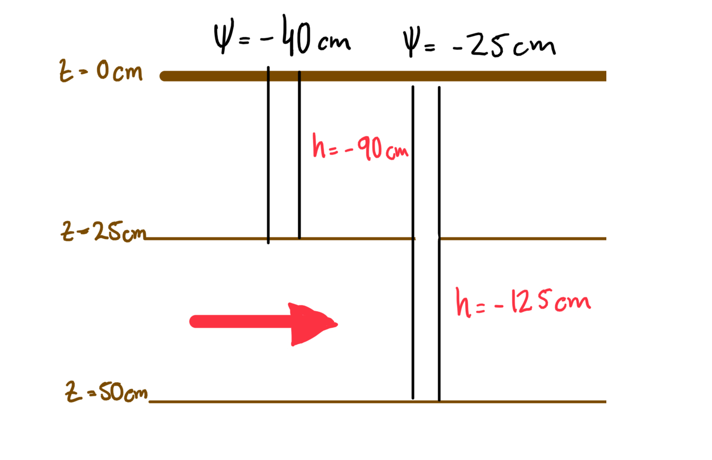
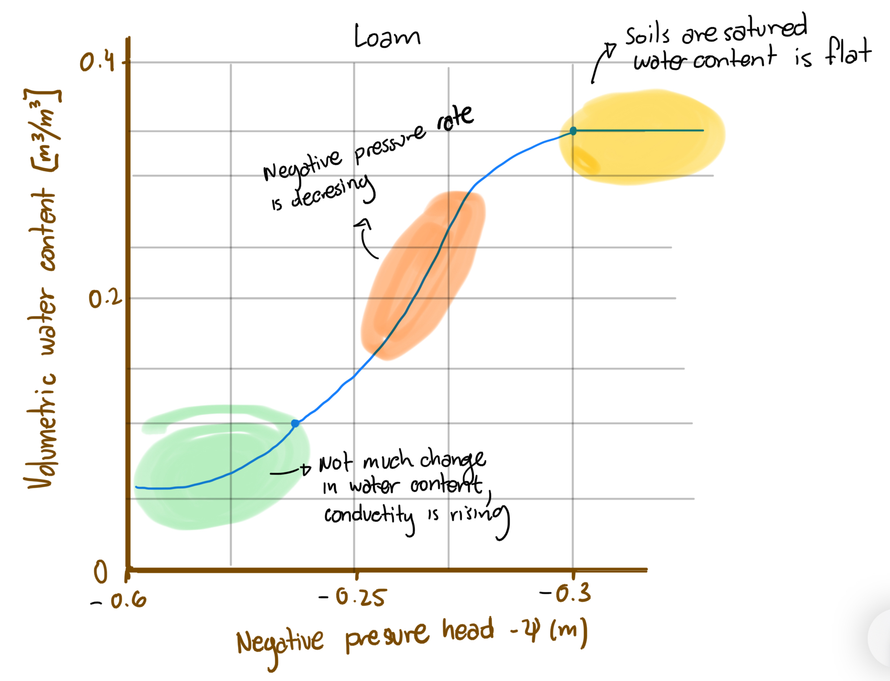
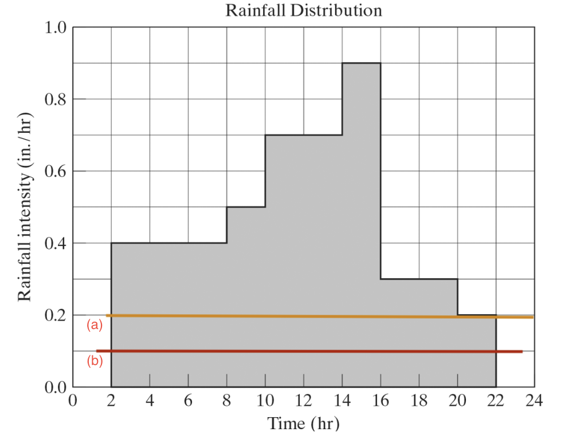

```{r setup, include=FALSE}
knitr::opts_chunk$set(echo = TRUE)
```

## 1.	At 25 cm below the land surface, the pressure head is -40 cm, while at 50 cm below the ground surface, the pressure head is -25 cm. Draw a picture of this scenario.  Calculate the hydraulic head at each point, using the land surface as your datum. Which direction does water flow in this example? Note this with an arrow on your drawing.  (5 pts)

```{r}
#Data
Ph1 <- -40 #Pressure head at point 1 in cm
Ph2 <- -25 #Pressure head at point 2 in cm

Eh1 <- -50 #Elevation head at point 1 in cm
Eh2 <- -100 #Elevation head at point 2 in cm

#Question
#Calculate the hydraulic head at each point

#Formulas
Hh1 <- Ph1 + Eh1
Hh2 <- Ph2 + Eh2

```

{width=60%}

```{r, echo=FALSE}
print(paste("The hydraulic head at the 1rst point is",round(Hh1, 0),"cm"),quote = FALSE)
print(paste("The hydraulic head at the 2nd point is",round(Hh2, 0),"cm"),quote = FALSE)
print("The water is runing to the second point",quote = FALSE)

```


## 2.	Given an initial rate of infiltration equal to 1.5 inches/hour and a final capacity of 0.5 inches/hour, use Horton’s equation to find the infiltration capacity at the following times: t=10 min, 15 min, 30 min, 1 hour, 2 hours, 4 hours, and 6 hours.  You may assume a time constant k = 0.25 hr-1.   Make a plot of infiltration (in/hr) versus time (hr) in MS Excel and attach to your homework.  Draw and fill in a table in the space below to answer this problem.  Make sure to include at least one example calculation.  (10 pts)

```{r}
#Data
fo_2 <- 1.5 #inches/hour
fc_2 <- 0.5 #inches/hour
K_2 <- 0.25 #hr-1

#Questions
t1 <- 10/60 #hour
t2 <- 15/60 #hour
t3 <- 30/60 #hour
t4 <- 1 #hour
t5 <- 2 #hour
t6 <- 4 #hours
t7 <- 6 #hours

t_2 <- as.numeric(list(t1, t2, t3, t4, t5, t6, t7))

```


Horton's equation
$$f(t) = fc + (fo - fc)e^{-kt}$$
Where:


f(t) = infiltration capacity (or rate) at time t (inches/hour)


fo = initial infiltration capacity (inches/hour)


fc = final (equilibrium) infiltration capacity (inches/hour)


k = empirical time constant (hour-1)


t = time since start (hours)


```{r}

#creates horton equation function
Horton_eq_2 <- function(fo, fc, k, t) {
  ft <- fc + (fo - fc)*exp(-k*t)
  return(ft)
}

#creates a list with all the time values
ft_2 <- c(
Horton_eq_2(fo_2, fc_2, K_2,t_2[1]),
Horton_eq_2(fo_2, fc_2, K_2,t_2[2]),
Horton_eq_2(fo_2, fc_2, K_2,t_2[3]),
Horton_eq_2(fo_2, fc_2, K_2,t_2[4]),
Horton_eq_2(fo_2, fc_2, K_2,t_2[5]),
Horton_eq_2(fo_2, fc_2, K_2,t_2[6]),
Horton_eq_2(fo_2, fc_2, K_2,t_2[7]))

#Creates a data frame with the values for a table
df <- data.frame(matrix(ncol = 2, nrow = 7))
x <- c("Time(hours)", "Infiltration Rate (inc/hour)")
colnames(df) <- x
df$`Time(hours)` <- round(t_2,2)
df$`Infiltration Rate (inc/hour)` <- round(ft_2,2)


```

```{r, echo=FALSE}
#Ploting the data

knitr::kable(df)

plot(df$`Time(hours)`,df$`Infiltration Rate (inc/hour)`, main="Infiltration Capacity", xlab="Time(hours)", ylab="Inlfration rate (inch/hour)")
```

\newpage

## 3.	Make a sketch of a moisture retention curve (soil moisture versus capillary suction) in the space below – using a soil type of your choice (make sure to note the soil type on your figure). Label your axis and provide units. Describe the different portions of the curve and discuss how it relates to infiltration.  (5 pts) 

{width=60%}

*This curves gives a model of the water holding capacities of soil, the soil holding capacity depends on the capillary forces in their pores. Loam soils are the in between Sand and Clay, so they would release the water with less pressure than the sandy soils, but with more pressure than clay soils. This means that a Loam soil will not fill the pores as quickly as sand but it would have more capacity at holding water.*

\newpage

## 4. Determine the Phi index of the figure below if the runoff depth was (a) 5.6 inches of rainfall over the watershed area and (b) 6.5 inches over the watershed area.  Make sure to draw in the Phi index on the graph below and label the line for (a) and (b).  (10 pts)


```{r}
#Data
ri_1 <- 0.4 #rain intensit 1 inch/hr
ri_2 <- 0.5 #rain intensit 1 inch/hr
ri_3 <- 0.7 #rain intensit 1 inch/hr
ri_4 <- 0.9 #rain intensit 1 inch/hr
ri_5 <- 0.3 #rain intensit 1 inch/hr
ri_6 <- 0.2 #rain intensit 1 inch/hr

#Try all the Phi zones
phi <- 0.4 
PhiIndex1 <- 6*(ri_1-phi) + 2*(ri_2-phi) + 4*(ri_3-phi) + 2*(ri_4-phi) + 4*(ri_5-phi) + 2*(ri_6-phi)
print(PhiIndex1)

phi <- 0.1
PhiIndex2 <- 6*(ri_1-phi) + 2*(ri_2-phi) + 4*(ri_3-phi) + 2*(ri_4-phi) + 4*(ri_5-phi) + 2*(ri_6-phi)
print(PhiIndex2)

phi <- 0.2
PhiIndex2 <- 6*(ri_1-phi) + 2*(ri_2-phi) + 4*(ri_3-phi) + 2*(ri_4-phi) + 4*(ri_5-phi) + 2*(ri_6-phi)
print(PhiIndex2) 

phi <- 0.13
PhiIndex2 <- 6*(ri_1-phi) + 2*(ri_2-phi) + 4*(ri_3-phi) + 2*(ri_4-phi) + 4*(ri_5-phi) 
print(PhiIndex2) 

phi <- 0.15
PhiIndex2 <- 6*(ri_1-phi) + 2*(ri_2-phi) + 4*(ri_3-phi) + 2*(ri_4-phi) + 4*(ri_5-phi) 
print(PhiIndex2)

```


```{r, echo=FALSE}
print(paste("a) The Phi index for 5.6 inches of rainfall is 0.2"),quote = FALSE)
print(paste("b) The Phi index for 6.5 inches of rainfall is 0.15"),quote = FALSE)
```
```


{width=60%}
